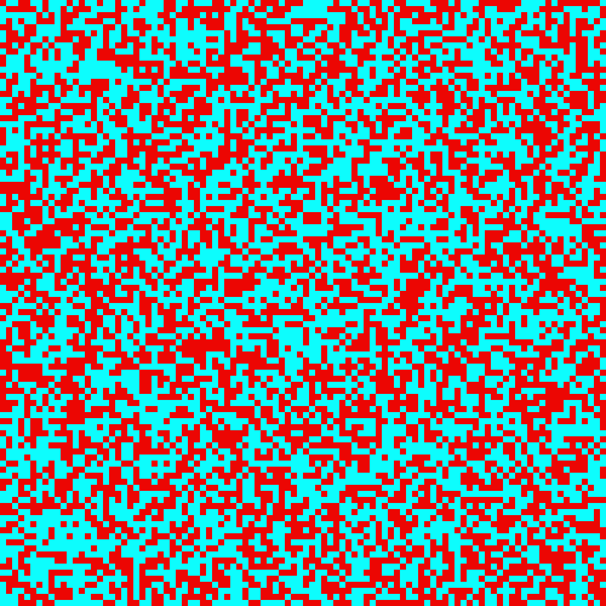
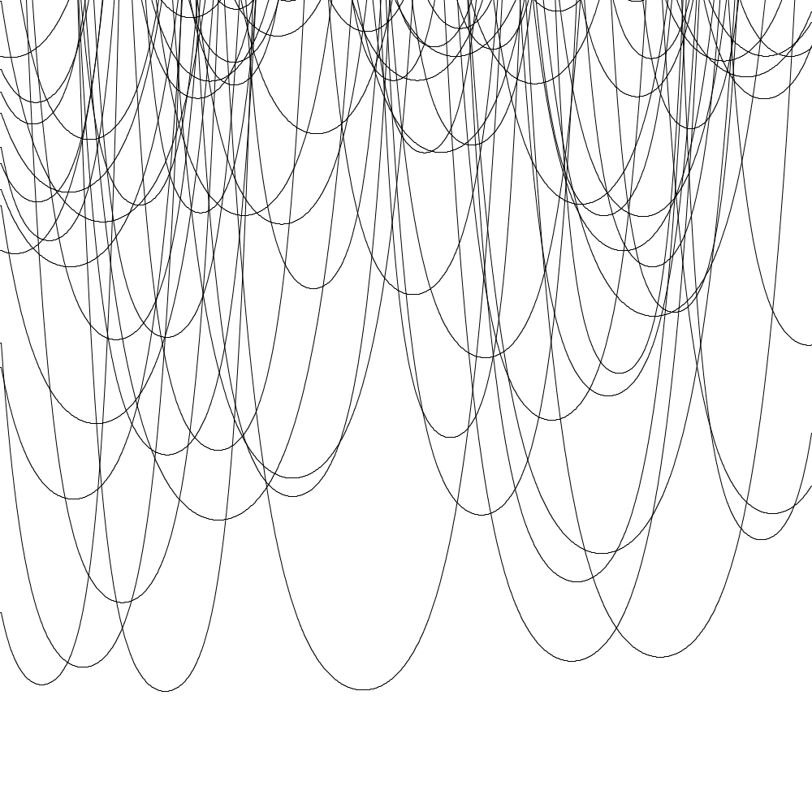
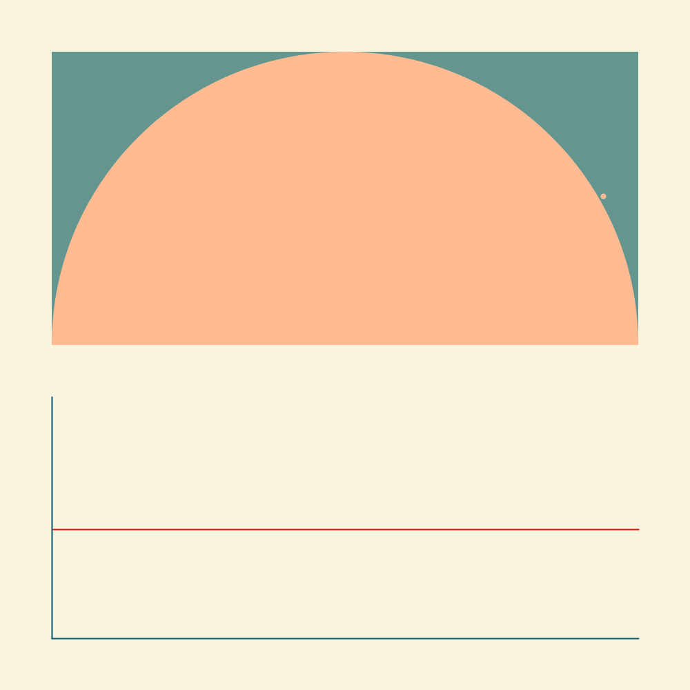

# processing-practice

| [lifegame](examples/lifegame/lifegame.pde) | [catenary](examples/catenary/catenary.pde) | [scalespace](examples/scalespace/scalespace.pde) | [pi](examples/pi/pi.pde) |
| :---: | :---: | :---: | :---: |
|  |  | ||

| [alignment](examples/alignment/alignment.pde) | [star](examples/star/star.pde) | xxx | xxx |
| :---: | :---: | :---: | :---: |
|  |  |  | 

